# NetPractice

## TCP/IP

인터넷에서 표준으로 사용되는 네트워크 프로토콜이다.  
이 프로토콜을 사용하여 전송되는 데이터는 <b>_패킷_</b>이라는 단위로 나뉘어져 통신한다. 각각의 패킷에는 상대방의 IP 주소가 포함되어 있고 네트워크에 흘러서 상대방에게 전달된다.  
IP는 네트워크 각 기기의 주소를 할당하거나 해당 주소를 기반으로 패킷을 전송하는 역할을 한다.  
TCP는 패킷의 수신 확인을 실시하며 올바른 순서로 패킷이 전달되도록 보장한다.  

 

## IP (Internet Protocol)

 

네트워크 상의 기기에 주소를 할당하거나 해당 주소로 패킷을 전송하는 역할을 수행한다.  
TCP와 같은 상위 계층에서 수신한 패킷에 IP 헤더라는 정보를 추가하여 네트워크에 전송한다. IP 헤더에는 송∙수신지의 IP 주소 등의 정보가 담겨있으며, 패킷은 이를 바탕으로 올바르게 전송된다.  
IP에는 경로를 선택하는 방법도 정의되어 있어 여러 개의 네트워크를 넘나드는 통신이 가능하다.  
실제로 LAN(Local Area Network)과 외부 네트워크를 연결하는 기기인 <b>_라우터_</b>가 IP 경로 선택(라우팅)을 지원하며, 이 라우터에서 대상이 속해있는 네트워크의 라우터로 패킷이 전송되어 목적지에 도착하는 것이다.

 

## TCP (Transmission Control Protocol)

데이터 손실이 없고, 확실하게 전송되는, 신뢰성이 높은 데이터 통신을 보장한다. 이를 위해 통신 데이터를 패킷으로 분할하고, IP에 전달하여 송신한다.  
네트워크 혼잡 상태에 따라 패킷의 손실이나 지연에 의해 순서가 뒤바뀌지 않도록 몇 가지 방법을 사용한다.

1. 분할 순으로 시퀀스 번호를 부여한다.  
   

2. 수신 측에서는 수신 패킷(ACK 패킷)을 송신 측에 전송한다.  
   

3. 일정 시간이 지나도 응답이 없는 경우 패킷을 재전송하여 손실을 방지한다.  
   

 

## Packet

패킷은 컴퓨터 통신에서 작게 분할된 통신 데이터 단위를 말한다.  

큰 데이터가 분할되지 않고 네트워크로 전송되면 이 데이터가 회선을 점유하여 다른 기기가 전혀 통신할 수 없는 문제가 발생한다.  

따라서 통신 데이터 하나가 점유하는 시간을 최소로 만들어 회선을 공유하기 위해 패킷 단위로 작게 분할한다.  
패킷에는 반드시 송신지와 수신지의 주소 같은 속성 정보가 포함되어 있어 네트워크를 통해 패킷이 올바른 목적지에 운반된다.  
패킷에는 패킷이 사용하는 네트워크 프로토콜에 대한 정보도 포함되어 있어, 여러 네트워크 프로토콜이 동일한 네트워크 회선 상에 혼재된 상태에서도 이용할 수 있다.  
통신 경로에 1초간 전송할 수 있는 데이터양은 네트워크 규격마다 정해져 있다.  

 

## Node

네트워크에 연결되어 있는 네트워크 기기나 네트워크의 연결 지점을 <b>_노드_</b>라고 한다.  
즉, 네트워크 케이블의 연결점이나 분기점이 되는 부분이 노드라는 의미로, 실제로는 네트워크에 연결된 기기라는 의미로 대부분 사용된다.  
네트워크에 연결된 컴퓨터, 허브, 라우터 등도 모두 노드이다.  
일반적으로 네트워크에서 컴퓨터끼리 직접 통신하는 경우는 드물며, 중간 기기가 중개하는 경우가 많다.

 

## IP Address

각 컴퓨터 한 대마다 할당된 식별 번호가 IP 주소다. 32 비트의 숫자로 나타내는 IPv4가 일반적이다. (ex. 192.168.0.1)  
실제로 IP 주소의 내용은 네트워크 별로 나뉘는 <b>_'네트워크 주소'_</b> 부분과 그 네트워크 내에서 컴퓨터를 식별하기 위한 <b>_'호스트 주소'_</b> 부분을 조합하여 구성된다.  

 

## IP Address Class

IP 주소 클래스는 IP 주소 체계를 네 가지 주요 클래스로 나누어 관리하는 방법을 설명한다.  

    클래스 A 주소 대역 (1.0.0.0 ~ 126.0.0.0)
    : 첫 번째 옥텟이 네트워크 식별자로 사용되고 남은 3개의 옥텟은 호스트 주소로 사용된다. 클래스 A 주소는 대규모 네트워크에 할당된다.

    클래스 B 주소 대역 (128.0.0.0 ~ 191.0.0.0)
    : 첫 번째 2개의 옥텟이 네트워크 식별자로 사용되고 남은 2개의 옥텟은 호스트 주소로 사용된다. 클래스 B 주소는 중간 규모의 네트워크에 할당된다.

    클래스 C 주소 대역 (192.0.0.0 ~ 223.0.0.0)
    : 첫 번째 3개의 옥텟이 네트워크 식별자로 사용되고 마지막 옥텟은 호스트 주소로 사용된다. 클래스 C 주소는 소규모 네트워크에 할당된다.

    클래스 D 주소 대역 (224.0.0.0 ~ 239.0.0.0)
    : 클래스 D 주소는 멀티캐스트 그룹 통신에 사용된다. 멀티캐스트 주소는 여러 호스트에 패킷을 동시에 전송하는데 사용된다.

    클래스 E 주소 대역 (240.0.0.0 ~ 255.0.0.0)
    : 클래스 E 주소는 특정 실험 및 연구를 위해 예약되어 있다.

    루프백 주소 (127.0.0.0 ~ 127.255.255.255)
    : 위 IP 주소의 범위는 루프백 주소로 예약되어 있으며, 이 주소 범위의 각 IP 주소는 로컬 호스트 또는 로컬 머신을 가리키며, 데이터를 루프백 인터페이스를 통해 자체로 전달한다.
    index.html을 로컬에서 만든 후 브라우저 창으로 열면, 다음과 같이 열리는 것을 확인할 수 있다. (http://127.0.0.1:5500/index.html)

 

## Subnet Mask

네트워크의 규모가 커지면 단일 네트워크로 관리하는 것이 사실상 어렵다. 특히 <b>_브로드캐스트_</b>라고 하는 네트워크 전체에 송신하는 데이터 전송이 발생할 경우 필요하지 않은 범위까지 불필요하게 회선을 사용하게 되어 네트워크 전체 효율이 나빠진다.  

 

이러한 문제를 해결하기 위해 네트워크를 논리적으로 분할하는데, 이것이 <b>_서브넷_</b>이다. 즉, 원래는 하나여야 할 네트워크를 작은 단위로 분할한 것을 말한다.  

 

<b>_서브넷 마스크_</b>는 이러한 서브넷을 표현하기 위한 값으로, IP 주소의 앞에서부터 몇 비트까지 네트워크 주소로 사용할지 정의하기 위해 사용한다.  
IP 주소는 네트워크 주소 부분과 호스트 주소 부분으로 나뉘는데, 서브넷 마스크에 의해 호스트 주소 부분 중 몇 개의 비트를 네트워크 주소 부분으로 재정의하여, 단일 네트워크를 서브넷으로 구분할 수 있다.  
여기서 호스트 개수는 서브넷 네트워크 주소와 브로드캐스트 주소를 제외한 뒤의 비트 1 ~ 254로 총 254개이다.  

 

## CIDR (Classless Inter-Domain Routing)

IP 주소와 그와 관련된 서브넷 마스크를 표기하기 위한 방법이다. CIDR 표기법은 IP 주소 뒤에 서브넷 마스크의 길이를 / 로 표시하여 사용한다. 이 표기법을 사용하면 IP 주소 클래스에 의존하지 않고 IP 주소 할당을 관리할 수 있다.

 

    예시 1) 192.168.0.1/25가 의미하는 서브넷 마스크 값은?

    25 비트를 네트워크 주소르 사용하고, 나머지 7 비트를 호스트 주소로 사용하겠다는 의미이다.
    즉, 255.255.255.128(11111111.11111111.11111111.10000000) 이 서브넷 마스크 값이다.

 

    예시 2) IPv4의 C 클래스 네트워크를 26개의 서브넷으로 나누고, 각 서브넷에는 4~5개의 호스트를 연결하려고 한다.
    이러한 서브넷을 구성하기 위한 서브넷 마스크 값은?

    255.255.255.128 의 경우 2개의 서브넷으로 나눌 수 있다. (네트워크 주소를 1개 쓸 경우, 0 또는 1)
    255.255.255.192 의 경우 4개의 서브넷으로 나눌 수 있다. (네트워크 주소를 2개 쓸 경우, 00 01 10 11)
    ...
    255.255.255.248 의 경우 32개의 서브넷으로 나눌 수 있다. (네트워크 주소를 5개 쓸 경우, 00 01 10 11)
    따라서 네트워크를 26개의 서브넷으로 나누기 위해서는 255.255.255.248 서브넷 마스크를 구성하면 된다.

 

## Hub

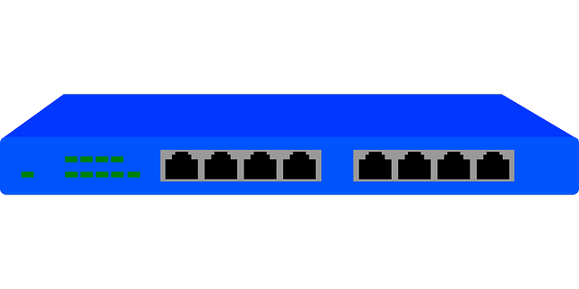

허브는 여러 개의 LAN 케이블을 연결하는 접선 장치다. 컴퓨터는 포트와 일대일로 연결되기 때문에 허브의 포트 수가 그 허브에 연결할 수 있는 컴퓨터의 수다.  
제품에 따라 포트 수는 다양하지만, 만약 포트 수가 부족하면 여러 대의 허브를 연결하는 형태로 간단하게 포트를 늘릴 수 있다.

 

## Switch

스위칭 기능을 가진 허브로, 여러 개의 LAN 케이블을 연결하기 위한 접선 장치다.  
스위칭 기능은 허브가 가진 여러 개의 포트 중에 실제로 통신이 발생한 포트만 연결하여 다른 포트에는 불필요한 패킷을 전송하지 않도록 한 것이다.  
스위칭 허브는 실제로 통신을 실시하는 포트에만 패킷을 보내기 때문에 다른 포트는 동시에 다른 통신을 할 수 있다. 이처럼 패킷 충돌을 억제하기 때문에 네트워크 효율성을 향상시킬 수 있다.  

 

## Router

 

서로 다른 네트워크를 상호 연결하기 위해 사용한다. 라우터는 네트워크 프로토콜 수준에서 경로 정보(라우팅 테이블)를 관리한다. 이 경로 정보를 기반으로 수신지의 네트워크로 통신 데이터를 중계한다.  
라우터가 대응하는 프로토콜은 제품마다 정해져 있으며, 저렴한 제품은 IP에만 대응하는 것이 일반적이다. 이 경우 경로를 선택할 때 주소 정보로 IP 주소를 사용한다.  

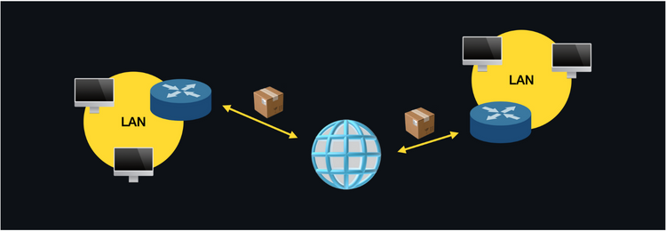 

IP 주소가 집 주소라면 라우터는 우체국의 역할과 비슷하다. IP 주소를 바탕으로 자신이 속한 네트워크 내가 수신지라면 외부로 송신하지 않고, 외부의 네트워크가 수신지라면 그쪽 네트워크를 담당하는 라우터에 패킷을 전송한다.  

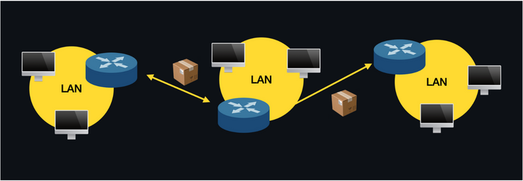 

하지만 인터넷처럼 연결된 네트워크가 방대한 경우에는 직접 상대방의 네트워크에 전송하는 것이 불가능하다. 이 경우 좀 더 처리하기에 적합하다고 생각하는 라우터에 다시 전송하는 식으로 최종 목적지 네트워크에 전당한다.

 

## Routing table

라우팅 테이블은 네트워크 장비인 라우터 등에 사용되는 데이터 통신의 결정을 지원하는 중요한 도구이다. 라우팅 테이블은 목적지 네트워크로 패킷을 전달할 때 어떤 경로를 선택해야 하는지 결정하는데 사용된다.  

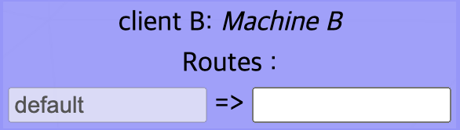 

다음은 라우팅 테이블에 대한 주요 특징과 역할에 대한 설명이다.

    목적지 네트워크 정보: 라우팅 테이블은 여러 목적지 네트워크와 관련된 정보를 포함한다. 각 항목은 목적지 네트워크 IP 주소 또는 서브넷을 나타내며, 해당 네트워크로 전송할 패킷의 경로를 결정하는 데 사용된다.

    default, 0.0.0.0/0: 디폴트 라우트로 목적지 주소가 지정되지 않았거나 다른 라우팅 항목과 일치하지 않을 때 사용된다.

    네트워크 마스크: 각 라우팅 테이블 항목은 목적지 네트워크 IP 주소와 함께 해당 네트워크를 식별하는 데 사용되는 서브넷 마스크를 포함한다. 서브넷 마스크는 목적지 주소의 네트워크 부분과 호스트 부분을 분리하는 역할을 한다.

    다음 홉(Next Hop) 정보: 라우팅 테이블에는 목적지 네트워크로 데이터 패킷을 전송할 때 사용해야 하는 다음 홉의 정보가 포함된다. 이 정보는 목적지로 향하는 패킷의 경로를 결정한다.

    그 외 인터페이스 정보, 거리 정보, 라우팅 프로토콜에 의한 업데이트 등의 특징을 갖는다.

 

 

## Level 1

Commentary

    

 

Level 1은 _Interface A1_ 과 _Interface B1_, 그리고 _Interface C1_ 과 _Interface D1_ 이 각각 같은 LAN 상에 연결되어 있다.  

_Interface B1_ IP 주소와 해당 서브넷 마스크 _255.255.255.0_ 을 & 연산하면 _Interface A1_ 의 IP 주소 범위 값을 구할 수 있다.  

    Interface B1 IP | 01101000 01100010 00010111 00001100
    Subnet Mask     | 11111111 11111111 11111111 00000000
    & 연산           | 01101000 01100010 00010111 00000000

서브넷 마스크에 따라 아래 8 비트를 변경할 수 있으므로, _Interface A1_ 의 IP 주소는, _104.98.23.1 ~ 104.98.23.254_ 사이에서 _Interface B1_ IP 주소를 제외한 값이다. (0은 네트워크 주소이고, 255는 브로드캐스트 주소이며, 12는 _Interface B1_ 의 주소이다.)  

마찬가지로 _Interface C1_ IP 주소와 해당 서브넷 마스크 _255.255.0.0_ 을 & 연산하면 다음과 같다.  

    Interface C1 IP | 11010011 10111111 01000011 01001011
    Subnet Mask     | 11111111 11111111 00000000 00000000
    & 연산           | 11010011 10111111 00000000 00000000

서브넷 마스크에 따라 아래 16 비트를 변경할 수 있으므로, _Interface D1_ 의 IP 주소는, _211.191.0.1 ~ 211.191.255.254_ 사이에서 _Interface C1_ 의 IP 주소를 제외한 값이다.  

Answer

    

 

## Level 2

Commentary

    

 

Level 2는 _Interface A1_ 과 _Interface B1_, 그리고 _Interface C1_ 과 _Interface D1_ 이 각각 같은 LAN 상에 연결되어 있다.  

_Interface A1_ 과 _Interface B1_ 가 연결되어 있으므로 _Interface B1_ 의 서브넷 마스크 값은 <b>_255.255.255.224_</b> 이다.
_Interface B1_ IP 주소와 해당 서브넷 마스크 _255.255.255.224_ 를 & 연산하면 _Interface A1_ 의 IP 주소 범위 값을 구할 수 있다.  

    Interface B1 IP | 11000000 10101000 01100110 11011110
    Subnet Mask     | 11111111 11111111 11111111 11100000
    & 연산           | 11000000 10101000 01100110 11000000

서브넷 마스크에 따라 아래 5 비트만 변경할 수 있으므로, _Interface A1_ 의 IP 주소는, _192.168.102.193 ~ 192.168.102.222_ 사이에서 _192.168.102.222_ 를 제외한 값이다. (마찬가지로 192는 네트워크 주소, 223은 브로드캐스트 주소이다.)  

_Interface C1_ 과 _Interface D1_ 의 서브넷 마스크는 _255.255.255.252_ 이므로 IP 주소로 가능한 경우의 수는 다음과 같다.

    Subnet Mask     | 11111111 11111111 11111111 11111100
    IP Address 1    | xxxxxxxx xxxxxxxx xxxxxxxx xxxxxx00
    IP Address 2    | xxxxxxxx xxxxxxxx xxxxxxxx xxxxxx01
    IP Address 3    | xxxxxxxx xxxxxxxx xxxxxxxx xxxxxx10
    IP Address 4    | xxxxxxxx xxxxxxxx xxxxxxxx xxxxxx11

IP Address 1과 4의 경우는 네트워크 주소와 브로드캐스트 주소로 사용하므로, _Interface C1_ 과 _Interface D1_ 의 IP 주소로 사용할 수 있는 경우는 <b>IP Address 2와 3</b>의 경우이다.
(여기서 IPv4 주소 클래스의 루프백 주소(127)는 사용이 불가능하다.)

Answer

    

 

## Level 3

Commentary

    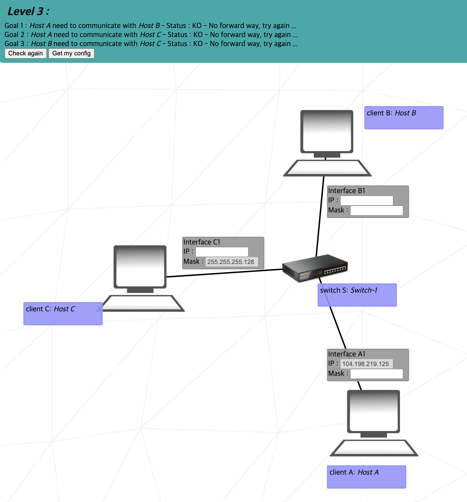

 

Level 3는 _Interface A1_, _Interface B1_, _Interface C1_ 이 하나의 스위치로 연결되어 있다.  
스위치는 여러 개의 LAN 케이블을 연결하기 위한 접선 장치이기 때문에 우선 _Interface A1_, _Interface B1_ 의 서브넷 마스크는 _Interface C1_ 의 서브넷 마스크와 일치해야 하므로 <b>_255.255.255.128_</b> 이다.  

_Interface C1_ IP 주소와 해당 서브넷 마스크 _255.255.255.128_ 을 & 연산하면 다음과 같다.  

    Interface C1 IP | 01101000 11000110 11011011 01111101
    Subnet Mask     | 11111111 11111111 11111111 10000000
    & 연산           | 01101000 11000110 11011011 00000000

서브넷 마스크에 따라 아래 7 비트를 변경할 수 있으므로, _Interface A1_, _Interface B1_ 이 가질 수 있는 IP 주소의 범위는 00000000 부터 01111111 로 <b>_104.198.219.1 ~ 104.198.219.126_</b> 사이에서 _Interface C1_ 의 IP 주소를 제외한 값이다. (마찬가지로 0은 네트워크 주소, 127은 브로드캐스트 주소이다.)

Answer

    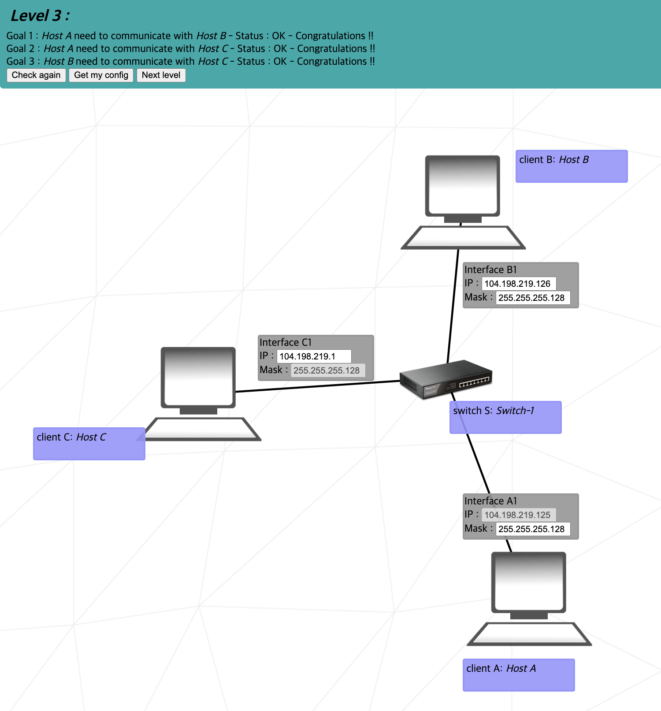

 

## Level 4

Commentary

    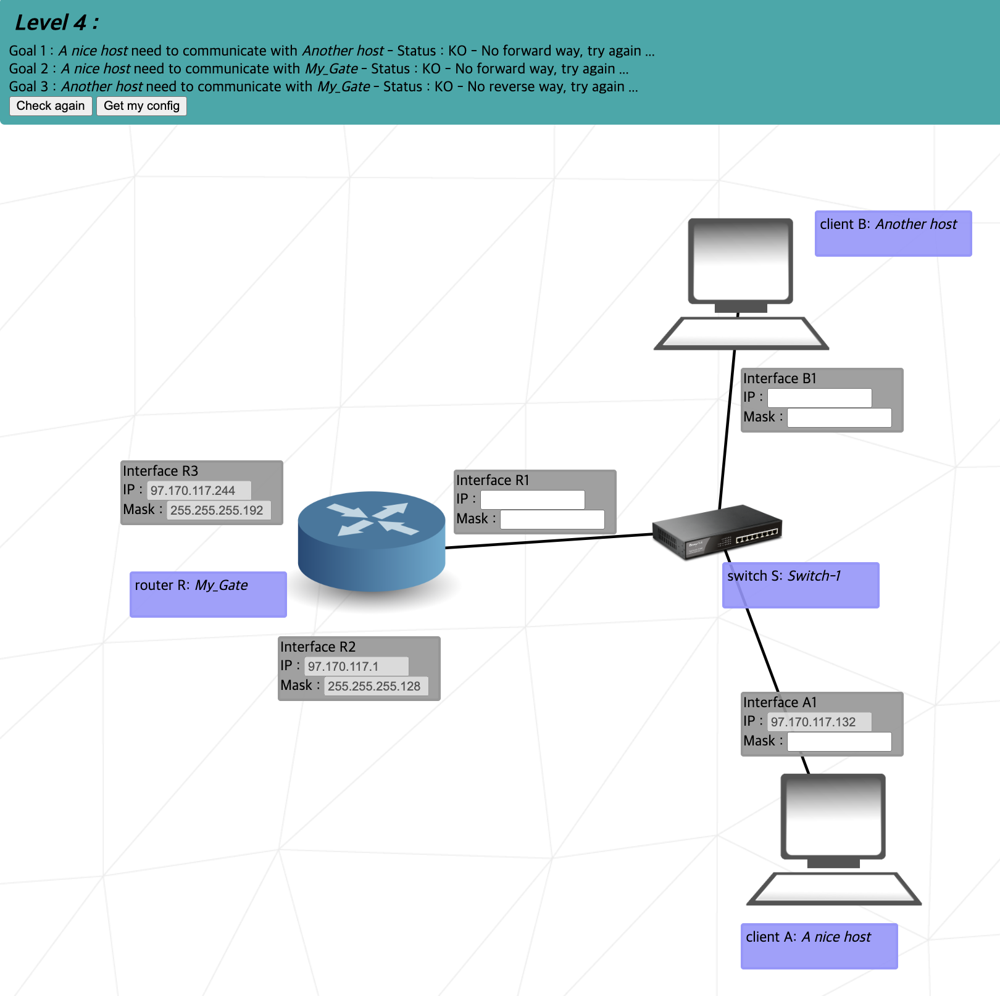

 

Level 4는 _Interface A1_, _Interface B1_, _Interface R1_ 이 하나의 스위치로 연결되어 있다. 따라서 세 Interface의 서브넷 마스크 값은 같아야 한다.  
제시된 문제에서는 아무것도 적혀있지 않으므로 계산에 편리하게 <b>_/24 (255.255.255.0)_</b> 로 작성한다.  
_Interface A1_ IP 주소와 해당 서브넷 마스크 _255.255.255.0_ 을 & 연산하면 다음과 같다.  

    Interface A1 IP | 01100001 10101010 01110101 10000100
    Subnet Mask     | 11111111 11111111 11111111 00000000
    & 연산           | 01100001 10101010 01110101 00000000

서브넷 마스크에 따라 아래 8 비트를 변경할 수 있으므로, _Interface B1_, _Interface R1_ 이 가질 수 있는 IP 주소의 범위는 <b>_97.170.117.1 ~ 97.170.117.132.254_</b> 사이에서 _Interface A1_ IP 주소를 제외해야 한다. 추가로 _Interface R1_ 은 _Interface R2_, _Interface R3_ 와 중복되지 않는 의 IP 주소 값을 가져야한다.

Answer

    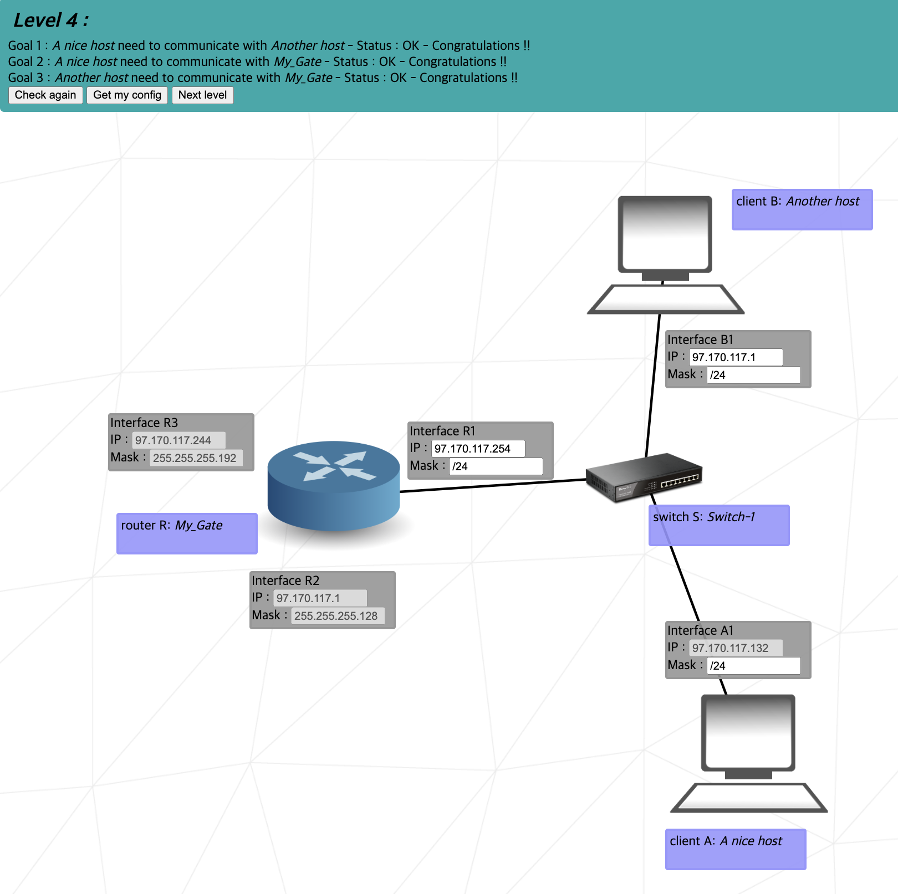

 

## Level 5

Commentary

    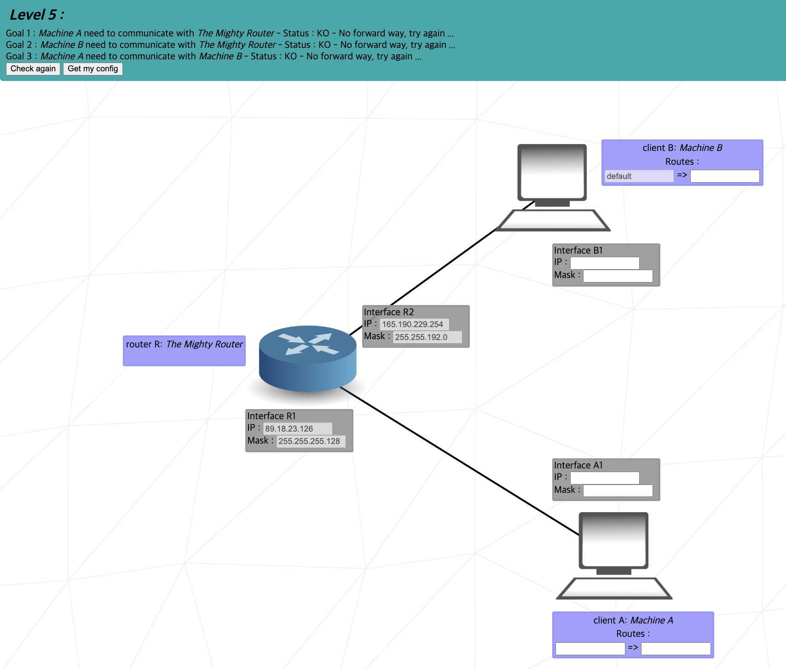

 

Level 5는 _Interface R1_, _Interface A1_ 그리고 _Interface R2_, _Interface B1_ 이 각각 LAN으로 연결되어 있다.  
따라서, _Interface A1_ 의 서브넷 마스크는 _Interface R1_ 과 동일하게 <b>_255.255.255.128_</b> 을 갖는다.
_Interface R1_ IP 주소와 해당 서브넷 마스크 _255.255.255.128_ 을 & 연산하면 다음과 같다.  

    Interface R1 IP | 01011001 00010010 00010111 01111110
    Subnet Mask     | 11111111 11111111 11111111 10000000
    & 연산           | 01011001 00010010 00010111 00000000

서브넷 마스크에 따라 아래 7 비트를 변경할 수 있으므로, _Interface A1_ 이 가질 수 있는 IP 주소의 범위는 <b>_89.18.23.1 ~ 89.18.23.126_</b> 사이의 값 중 _Interface R1_ IP 주소를 제외한 값이다.  

_Interface B1_ 의 서브넷 마스크는 _Interface R2_ 과 동일하게 <b>_255.255.192.0_</b> 을 갖는다.
_Interface R2_ IP 주소와 해당 서브넷 마스크 _255.255.192.0_ 을 & 연산하면 다음과 같다.  

    Interface R2 IP | 10100101 10111110 11100101 11111110
    Subnet Mask     | 11111111 11111111 11000000 00000000
    & 연산           | 10100101 10111110 11000000 00000000

서브넷 마스크에 따라 아래 14 비트를 변경할 수 있으므로, _Interface A1_ 이 가질 수 있는 IP 주소의 범위는 <b>_165.190.192.1 ~ 165.190.255.254_</b> 사이의 값 중 _Interface R2_ IP 주소를 제외한 값이다.  

 

_client A_ 가 패킷을 보낼 수 있는 경로는 오직 하나이므로 라우팅 테이블의 destination은 <b>_default_</b> 로 설정하고, Next hop은 <b>_Interface R1 의 IP 주소_</b> 를 입력한다.  
_client B_ 도 패킷을 보낼 수 있는 경로는 오직 하나이므로 라우팅 테이블의 destination은 <b>_default_</b> 로 설정하고, Next hop은 <b>_Interface R2 의 IP 주소_</b> 를 입력한다.

Level 5

    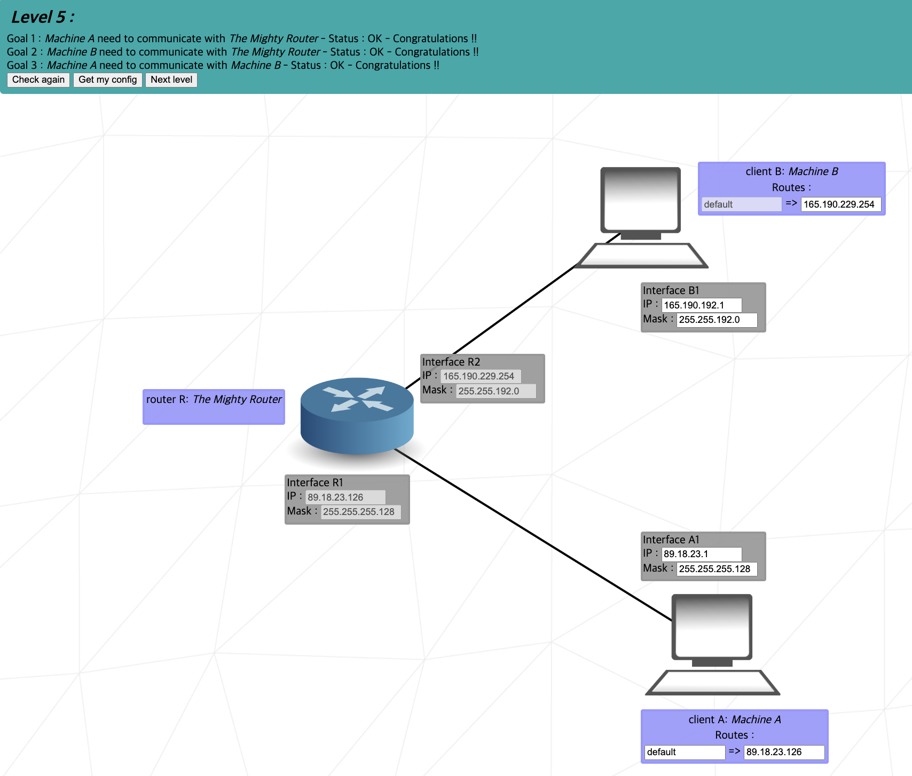

 

## Level 6

Commentary

    

 

Level 6은 인터넷과 통신하는 경로를 보여준다.  
우선 _Interface A1_ 과 _Interface R1_ 이 스위치로 연결되어 있으므로, _Interface A1_ 의 서브넷 마스크는 <b>_255.255.255.128_</b> 이다.  

_Interface A1_ 의 IP 주소와 해당 서브넷 마스크 _255.255.255.128_ 을 & 연산하면 다음과 같다.  

    Interface A1 IP | 00010100 10100010 11101111 11100011
    Subnet Mask     | 11111111 11111111 11111111 10000000
    & 연산           | 00010100 10100010 11101111 10000000

서브넷 마스크에 따라 아래 7 비트를 변경할 수 있으므로, _Interface R1_ 이 가질 수 있는 IP 주소의 범위는 <b>_20.162.239.129 ~ 165.190.255.254_</b> 사이의 값 중 _Interface A1_ 의 IP 주소를 제외한 값이다.  

 

문제는 _Interface A1 need to communicate with interface Somewhere ont the Net_ 으로 제시되어 있다.  

_client A_ 가 패킷을 보낼 수 있는 경로는 _Interface Somewhere on the Net_ 이므로 라우팅 테이블의 destination은 <b>_8.8.8.8/16_</b> 으로 설정하고, Next hop은 _Interface R1_ 을 거치기 때문에, <b>_Interface R1 의 IP 주소_</b> 를 입력한다.  

_router R_ 의 destination도 _Interface Somewhere on the Net_ 이므로 라우팅 테이블의 destination은 <b>_8.8.8.8/16_</b> 으로 설정한다.

_internet I_ 가 패킷을 보낼 destination은 _client A_ 이므로 destination에 _Interface A1의 IP 주소/Mask_ 를 CIDR 표기법으로 입력한다.

Answer

    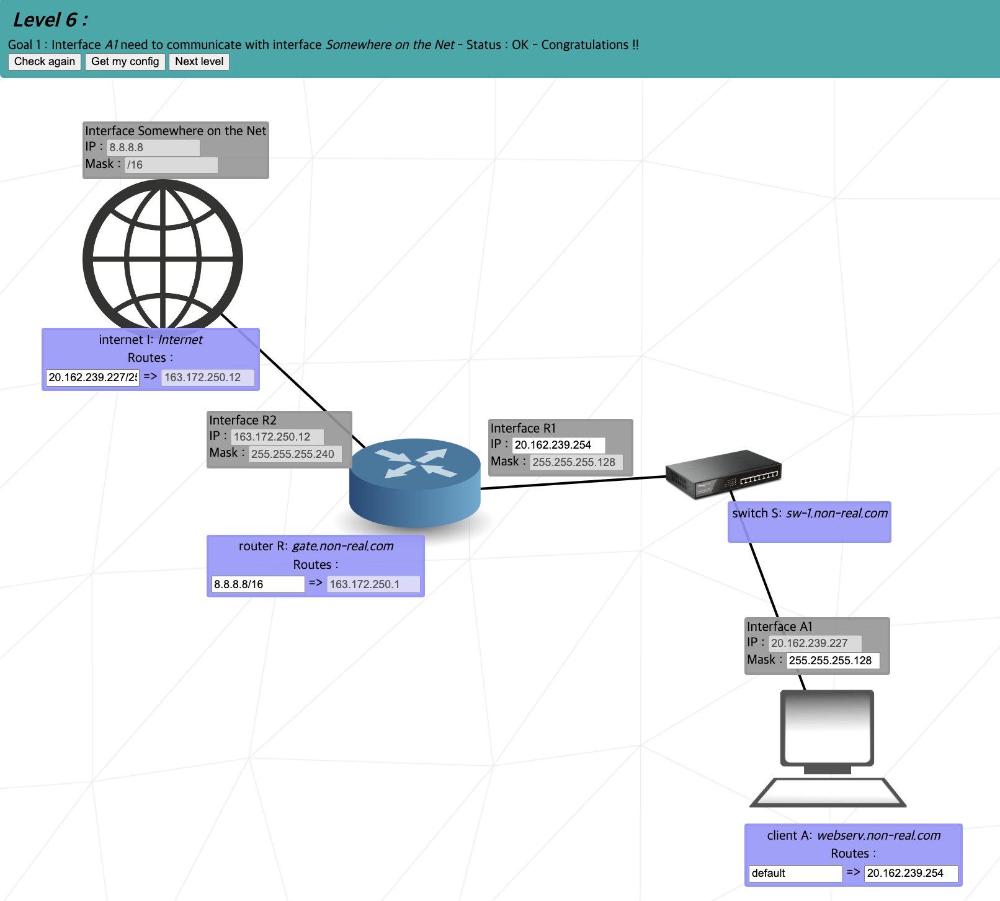

 

## Level 7

Commentary

    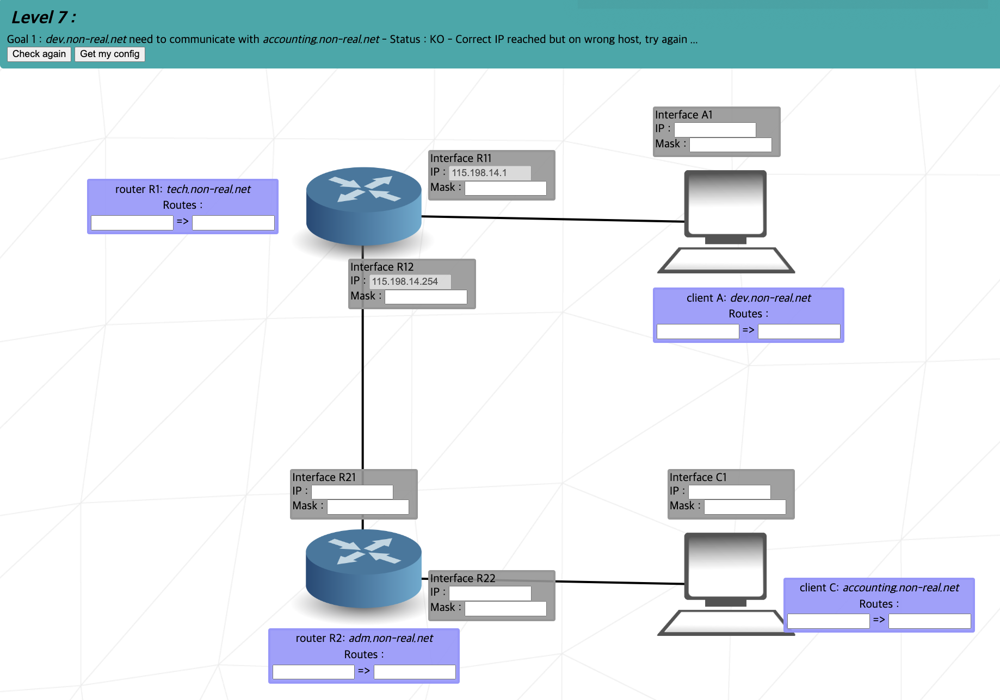

 

Level 7에서 유의할 점은 <b>IP 주소 겹침(IP address overlap)</b>이다. 네트워크 구성에서 발생하는 문제 중 하나로, 동일한 IP 주소 범위가 서로 다른 서브넷 또는 네트워크에서 중복 사용될 때 발생한다.  

따라서 세 개의 서브넷이 구분되어야 한다.  

    1. Interface A1 과 Interface R1
    2. Interface R1 과 Interface R2
    3. Interface R2 와 Interface C1

세 개의 서브넷을 구분짓기 위해서는 <b>_/26_</b> 의 서브넷 마스크가 용이하다. 그렇게 하면, 00 01 10 11 의 네 가지 경우가 생성되어 배분하기 적절하다. 

    Subnet 1. 115.198.14.1 ~ 115.198.14.62
                   (115.198.14.00000001 ~ 115.198.14.00111110)

    Subnet 2. 115.198.14.65 ~ 115.198.14.124
                   (115.198.14.01000001 ~ 115.198.14.00111110)

    Subnet 3. 115.198.14.129 ~ 115.198.14.190
                   (115.198.14.10000001 ~ 115.198.14.10111110)

    Subnet 4. 115.198.14.193 ~ 115.198.14.254
                   (115.198.14.11000001 ~ 115.198.14.11111110)

우선, _Interface R11_ 의 IP 주소가 _115.198.14.1_ 로 **Subnet 1**에 해당되어 _Interface A1_ 의 IP 주소는 <b>_115.198.14.2 ~ 115.198.14.62_</b> 사이의 값을 갖는다.  

_Interface R12_ 의 IP 주소가 _115.198.14.254_ 로 **Subnet 4**에 해당되어 _Interface R21_ 의 IP 주소는 <b>_115.198.14.193 ~ 115.198.14.253_</b> 사이의 값을 갖는다.  

**Subnet 2** 와 **Subnet 3** 중 하나를 택해 _Interface R22_ 와 _Interface C1_ 의 IP 주소를 결정하면 된다.  

 

문제에서 _dev.non-real.net need to communicate with accounting.non-real.net_ 이라 명시되어 있다. 즉, _client A_ 와 _client C_ 가 라우터를 활용하여 통신해야 한다.  

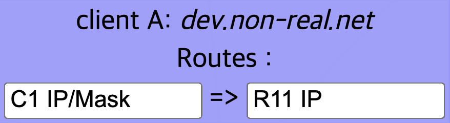 
_client A_ 의 라우팅 테이블에서 destination은 _client C_ (_Interface C1_) 의 IP 주소와 서브넷 마스크를 CIDR 표기법으로 입력한다. 그리고 패킷이 전달될 수 있도록 다음 라우터(_Interface R11_) IP 주소를 입력한다. (또는 _default_ 를 입력해도 무관하다.)  

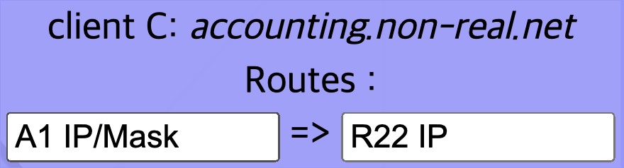 
_client C_ 의 라우팅 테이블에서 destination은 _client A_ (_Interface A1_) 의 IP 주소와 서브넷 마스크를 CIDR 표기법으로 입력한다. 그리고 패킷이 전달될 수 있도록 다음 라우터(_Interface R22_) IP 주소를 입력한다. (또는 _default_ 를 입력해도 무관하다.)  

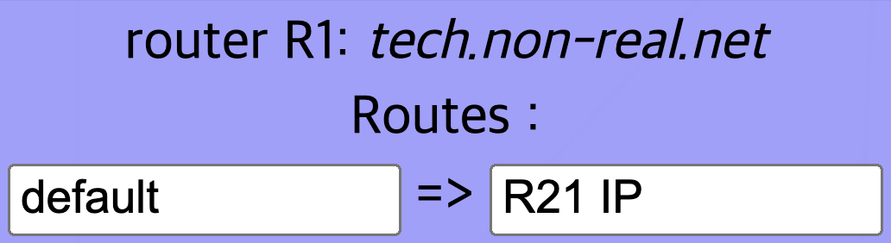 
_router R1_ 의 라우팅 테이블에서 destination은 _default_ 로 작성한다. 그리고 패킷이 전달될 수 있도록 다음 라우터(_Interface R21_) IP 주소를 입력한다.  

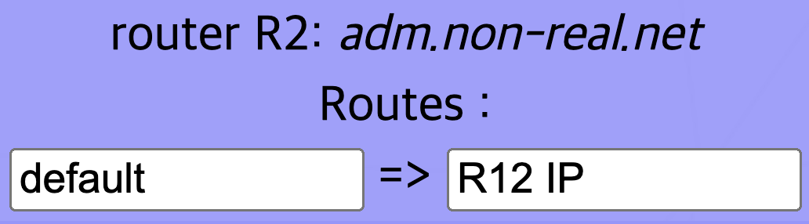 
_router R2_ 의 라우팅 테이블에서 destination은 _default_ 로 작성한다. 그리고 패킷이 전달될 수 있도록 다음 라우터(_Interface R12_) IP 주소를 입력한다.  

    💡 디폴트 라우트(default 또는 0.0.0.0/0)를 사용하면 라우팅 테이블을 간단하게 유지할 수 있다.
    목적지 주소가 수천 개 또는 그 이상인 대규모 네트워크에서 모든 목적지를 명시적으로 정의하는 것은 번거로울 수 있으며,
    디폴트 라우트를 사용하면 테이블의 크기를 줄일 수 있다.

Answer

    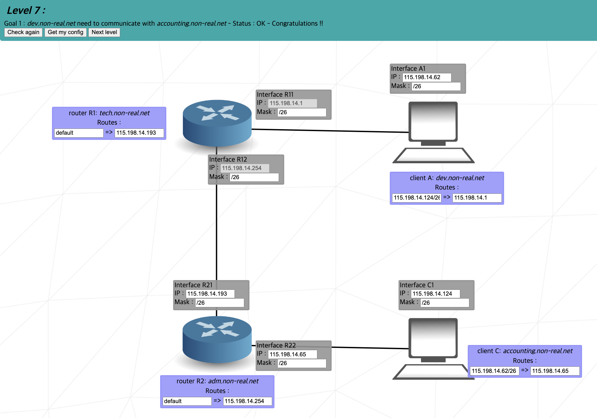

 

## Level 8

Commentary

    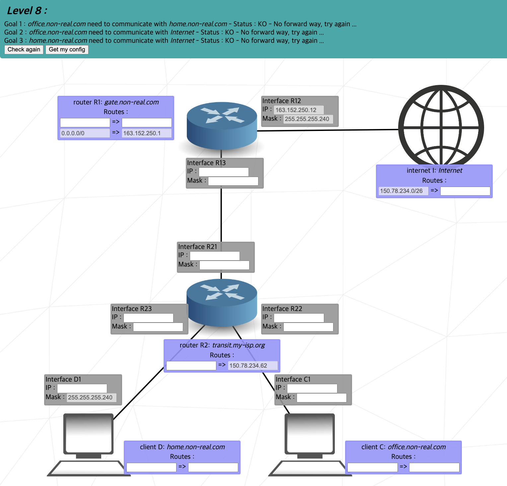

 

_internet I_ 은 _Interface R12_ 와 연결되어 있다. 따라서 _internet I_ 의 라우팅 테이블에서 Next hop은 _Interface R12의 IP 주소_ 라는 것을 알 수 있다.  
또한, destination이 _150.78.234.0/26_ 라는 것을 통해 모든 Interface의 범위를 구하면,  

    Destination | 10010110 01001110 11101010 00000000
    Subnet Mask | 11111111 11111111 11111111 11000000
    & 연산       | 10010110 01001110 11101010 00000000

서브넷 마스크에 따라 아래 6 비트를 변경할 수 있으므로, Interface 가 가질 수 있는 IP 주소의 범위는 <b>_150.78.234.1 ~ 150.78.234.62_</b> 사이의 값을 갖는다.  
따라서 모든 패킷을 받는 네트워크는 중복되지 않으면서 위 범위 안에 있어야 한다.  
 
또한, _Interface R12_ 와 _Interface D1_ 의 서브넷 마스크가 _255.255.255.240(/28)_ 이므로, 모든 Interface 의 서브넷 마스크를 편의상 동일하게 <b>_255.255.255.240_</b> 로 입력한다.  
_/28_ 을 서브넷 마스크로 사용할 경우 총 2^4 = 16 개의 서브넷을 생성할 수 있다.  

    Subnet 1. 150.78.234.1 ~ 150.78.234.14
    Subnet 2. 150.78.234.17 ~ 150.78.234.30
    Subnet 3. 150.78.234.33 ~ 150.78.234.46
    Subnet 4. 150.78.234.49 ~ 150.78.234.62
    Subnet 5. 150.78.234.65 ~ 150.78.234.78
    Subnet 6. 150.78.234.81 ~ 150.78.234.94
    Subnet 7. 150.78.234.97 ~ 150.78.234.110
    Subnet 8. 150.78.234.113 ~ 150.78.234.126
    Subnet 9. 150.78.234.129 ~ 150.78.234.142
    Subnet 10. 150.78.234.145 ~ 150.78.234.158
    Subnet 11. 150.78.234.161 ~ 150.78.234.174
    Subnet 12. 150.78.234.177 ~ 150.78.234.190
    Subnet 13. 150.78.234.193 ~ 150.78.234.206
    Subnet 14. 150.78.234.209 ~ 150.78.234.222
    Subnet 15. 150.78.234.225 ~ 150.78.234.238
    Subnet 16. 150.78.234.241 ~ 150.78.234.254

 
 

여기서 _router R2_ 의 Next hop 고정 값을 보면, _150.78.234.62_ 로 되어 있고, _Interface R13_ 과 연결되어 있기 때문에, _Interface R13_ 의 IP 주소값은 _150.78.234.62_ 이다.  

Interface 가 가질 수 있는 IP 주소의 범위는 <b>_150.78.234.1 ~ 150.78.234.62_</b> 사이의 값을 갖기 때문에, Subnet 1, 2, 3, 4를 사용할 수 있다. 
_Interface R2_ 와 _Interface C1_ 는 Subnet 1 주소를 사용하고,  
_Interface R2_ 와 _Interface D1_ 는 Subnet 2 주소를 사용한다.  
_Interface R1_ 과 _Interface R2_ 는 Subnet 4 주소를 사용하고,  

_router R1_, _router R2_, _client C_, _client D_ 라우팅 테이블의 destination에는 공통적으로 _default_ 로 적어준다.  
그리고 Next hop 자리에는 각각 연결된 라우터의 IP 주소를 입력해 준다.

Answer

    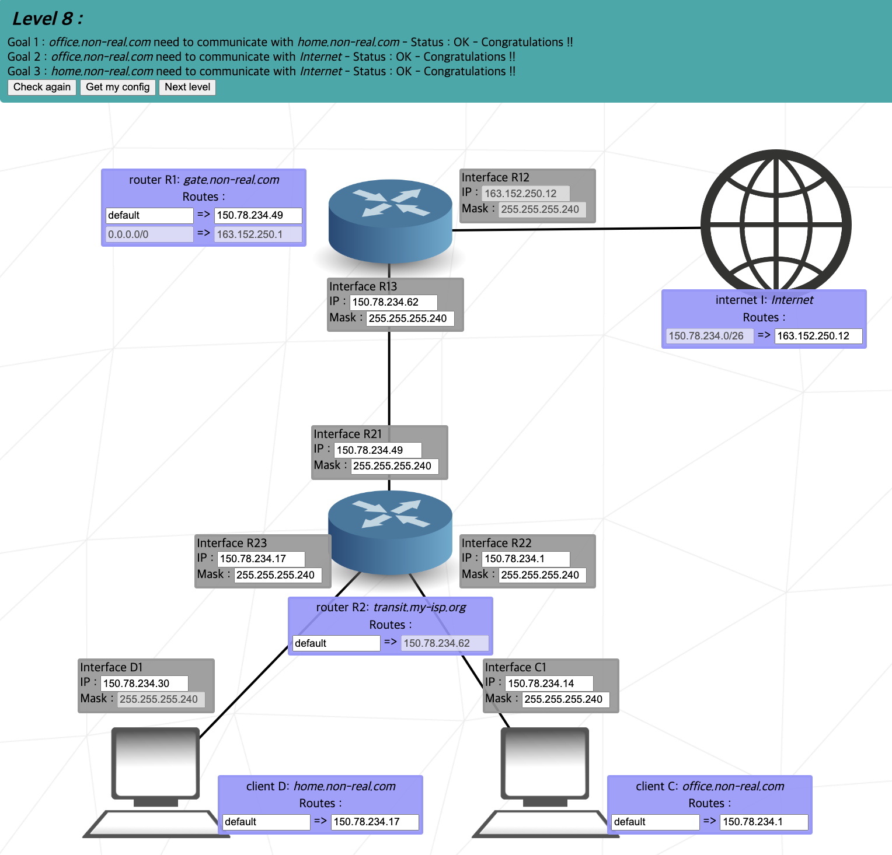

 

## Level 9

Commentary

    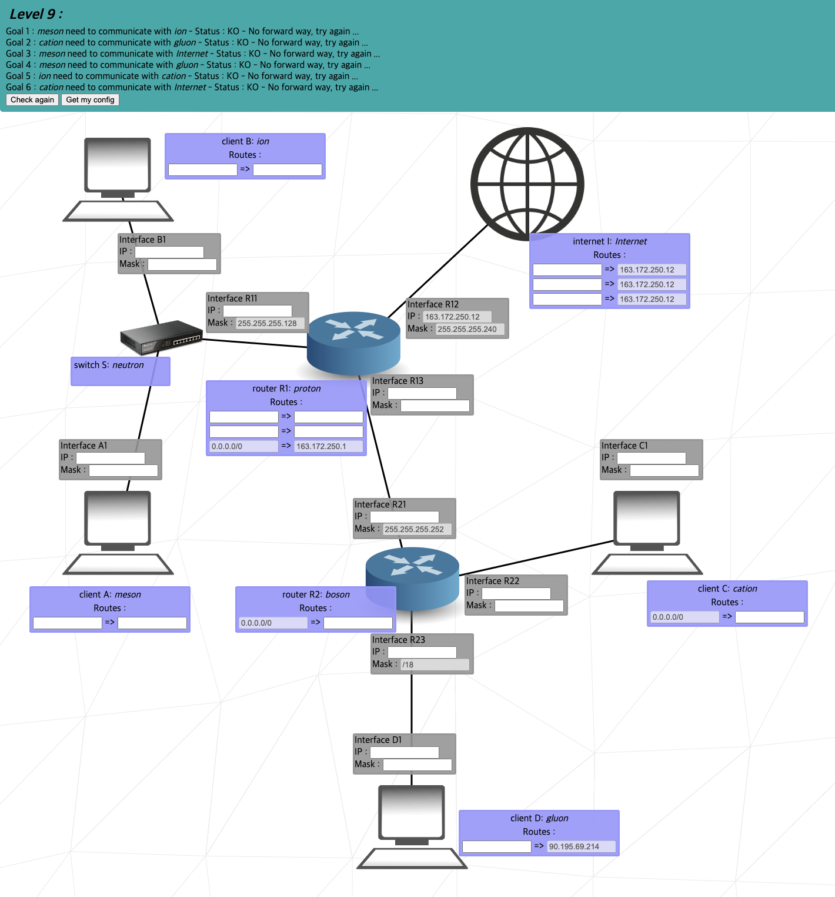

 

Level 9는 위의 문제들과는 다르게 IP 주소를 임의로 작성해 주어야 하기 때문에 다음의 사설 IP 주소는 피하도록 한다.  

    10.0.0.0 ~ 10.255.255.255
    172.16.0.0 ~ 172.31.255.255
    192.168.0.0 ~ 192.168.255.255

 

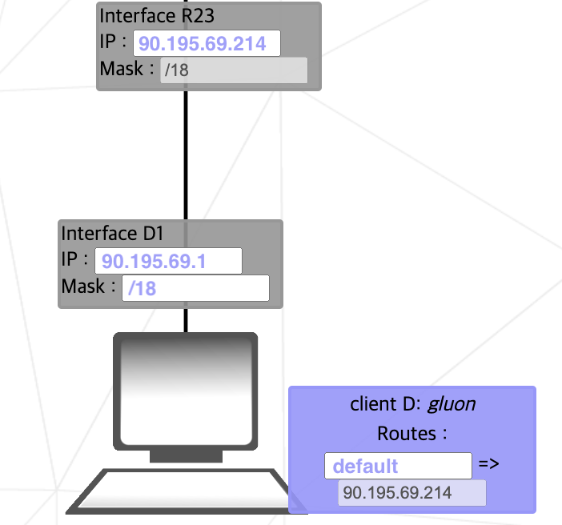 

우선 _Interface R23_ 과 _Interface D1_ 을 해결한다. _client D_ 의 라우팅 테이블의 Next hop이 _90.195.69.214_ 이므로, _Interface R23_ 의 IP는 <b>_90.195.69.214_</b> 이다.  
그리고 _Interface D1_ 의 서브넷 마스크도 _Interface R23_ 과 마찬가지로 <b>_/18_</b> 이다.  
_Interface D1_ 의 IP 주소의 범위는 <b>_90.195.64.1 ~ 90.195.127.254_</b> 이다.  

 

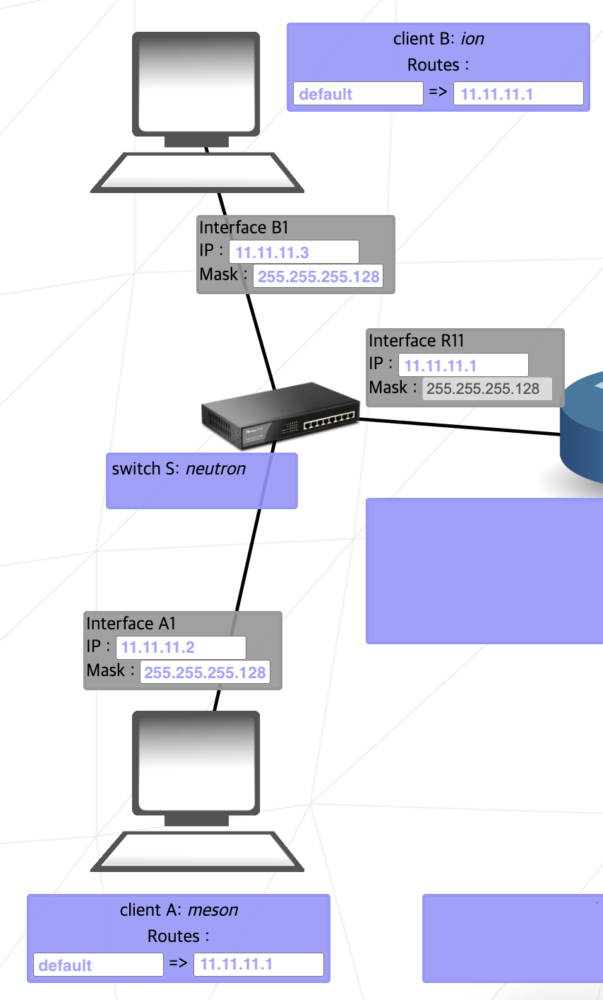 

_Interface B1_ 과 _Interface A1_ 과 _Interface R11_ 은 같은 스위치에 연결되어 있으므로, 세 Interface 의 서브넷 마스크는 <b>_255.255.255.128_</b> 로 동일하다.  
세 개의 Interface 의 IP 주소는 사설 IP 주소만 피하면 되므로, 임의로 <b>_11.11.11.x_</b> 로 작성한다.  
_client A_ 와 _client B_ 의 라우팅 테이블의 Next hop은 <b>_Interface R11의 IP 주소_</b> 로 입력한다.  

 

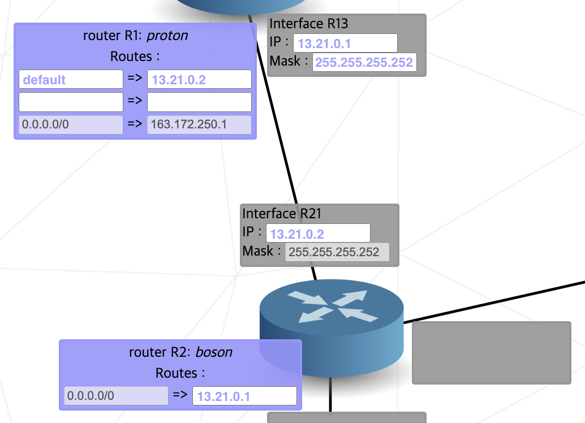 

_Interface R21_ 과 _Interface R13_ 이 연결되어 있으므로, 같은 서브넷 마스크를 사용하기 때문에 _Interface R13_ 의 서브넷 마스크 값은 <b>_255.255.255.252_</b> 이다.  
_router R1_ 은 _Interface R21_ 를 통해 통신하므로, Next hop에 <b>_Interface R21의 IP 주소_</b> 로 입력한다.  
_router R2_ 은 _Interface R13_ 를 통해 통신하므로, Next hop에 <b>_Interface R13의 IP 주소_</b> 로 입력한다.  

 

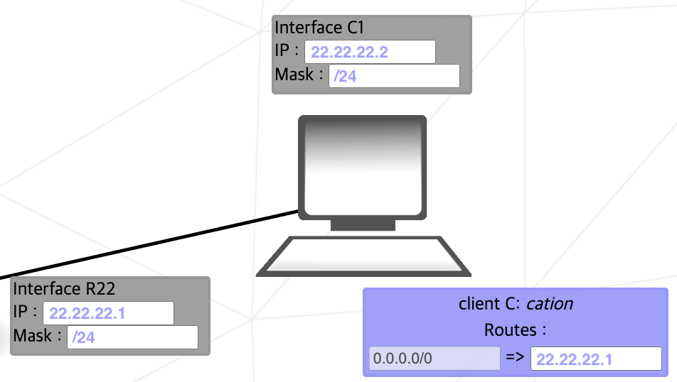 

_Interface R22_ 와 _Interface C1_ 은 연결되어 있으므로 같은 서브넷 마스크를 공유한다. 값이 정해져 있지 않으므로 임의의 값으로 <b>_/24_</b> 를 입력한다.  
_Interface R22_ 와 _Interface C1_ 의 IP 주소도 정의되어 있지 않으므로, 사설 IP 주소만 피하면 되므로, 임의로 <b>_22.22.22.x_</b> 로 작성한다.  
_client C_ 는 _Interface R22_ 를 통해 통신하므로, Next hop에 <b>_Interface R22의 IP 주소_</b> 로 입력한다.  

 

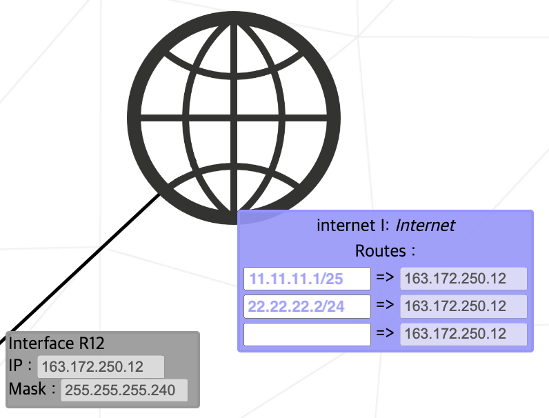 

_Goal 3_ 와 _Goal 6_ 을 고려했을 때, _internet I_ 의 destination에 들어갈 수 있는 IP 주소는 <b>_client A: meson_ 과 _client C: cation_ 의 IP 주소</b>를 각각 입력한다.

Answer

    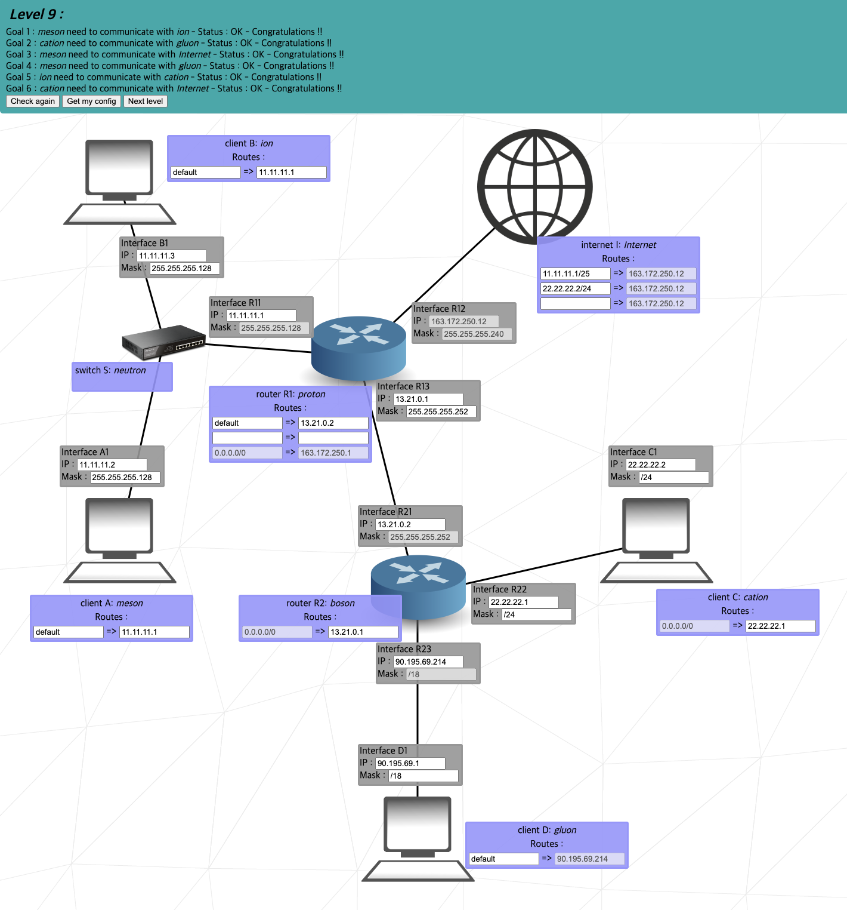

 

## Level 10

Commentary

    

 

Level 10은 4개의 네트워크가 존재한다.  

    router R1 --- switch S1
    router R1 --- router R2
    router R2 --- client H4
    router R2 --- client H3

따라서 IP 주소를 설정할 때는 IP 주소가 1) 인터넷의 destination 범위 안에 존재해야 하며, 2) 4개의 네트워크의 IP 주소 범위가 겹쳐서는 안 된다.  

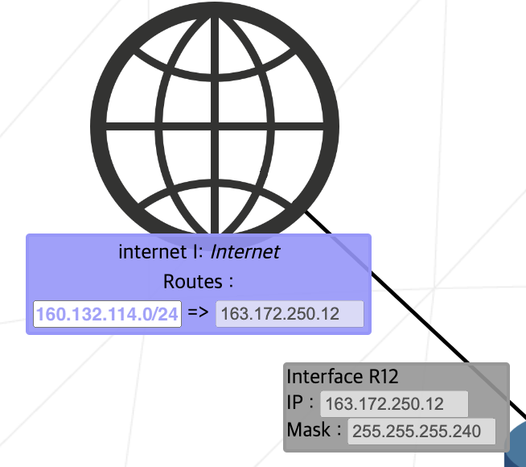 

고정값으로 제시되어 있는 IP 주소들은 공통적으로 _160.132.114.xxx_ 로 구성되어 있다.  
따라서 _internet I_ 라우팅 테이블의 destination 값을 <b>_160.132.144.0/24_</b> 로 설정한다.  
서브넷 마스크를 <b>_/24_</b> 로 설정하면 패킷을 보낼 수 있는 모든 네트워크의 범위 <b>_163.172.144.1 ~ 163.172.144.254_</b> 를 가질 수 있다.  

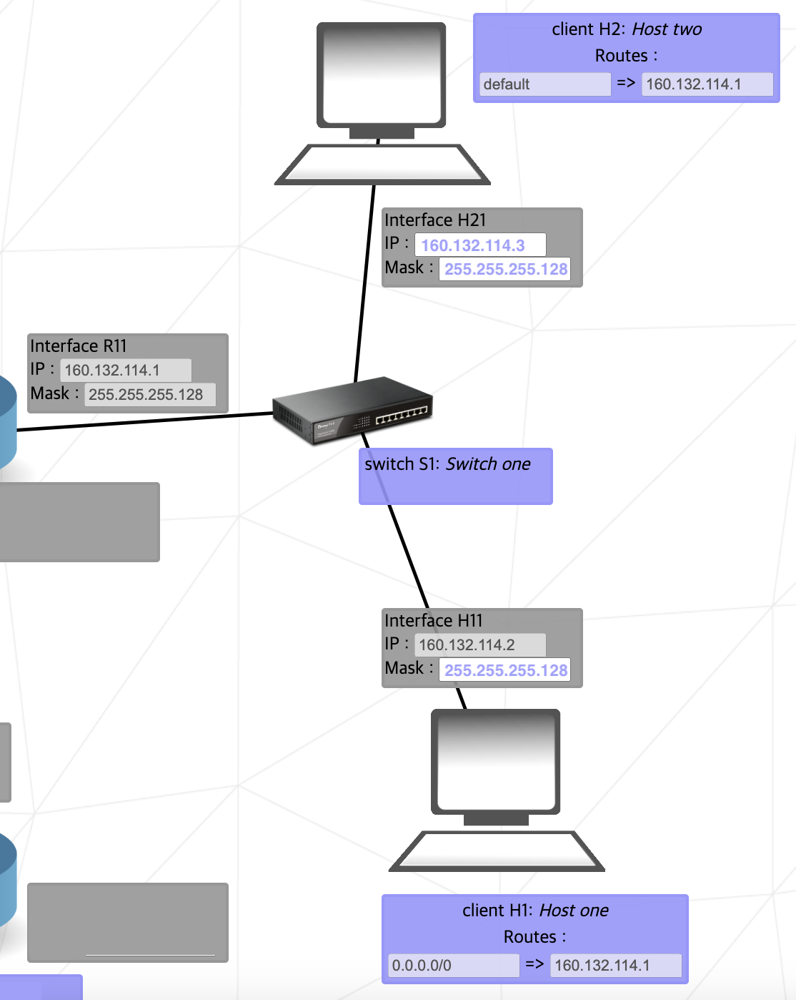 

우선 _Interface R11_ 과 _switch S1_ 으로 연결된 _Interface H11_ 과 _Interface H21_ 을 같은 서브넷 마스크(_/25_)로 설정한다.  
_Interface R11_ 의 IP 주소와 서브넷 마스크를 & 연산하면 다음과 같은 주소 범위가 나온다.  

    160.132.114.1 ~ 160.132.114.126

따라서 _Interface H11_ 과 _Interface H21_ 의 IP 주소를 위의 서브넷 네트워크 범위 내에서 설정한다.  

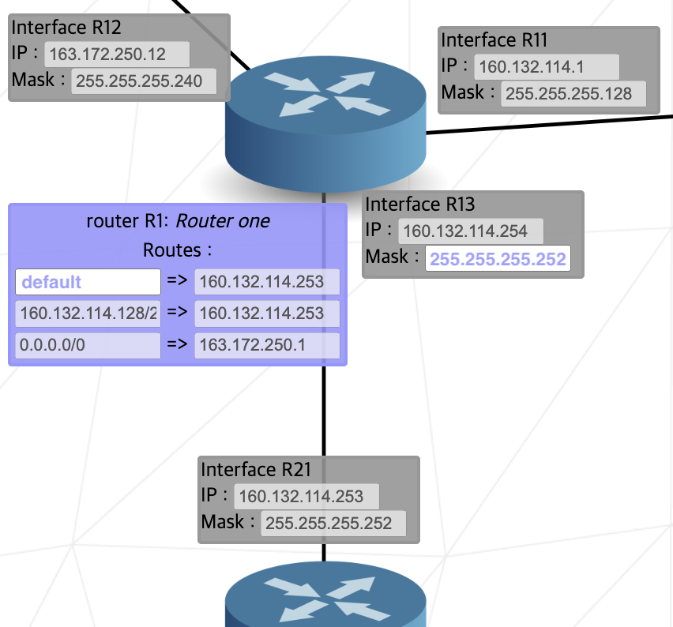 

다음으로 _Interface R13_ 과 _Interface R21_ 이 연결되어 있으므로, _Interface R13_ 의 <b>서브넷 마스크(/30)를 일치시킨다.</b>  
_router R1_ 에는 Next hop을 _Interface R21_ 로 사용한 목적지를 작성해야 하는데, 목적지가 _client H4_ 또는 _client H3_ 가 될 수 있으므로 <b>_default_</b> 로 입력한다.  

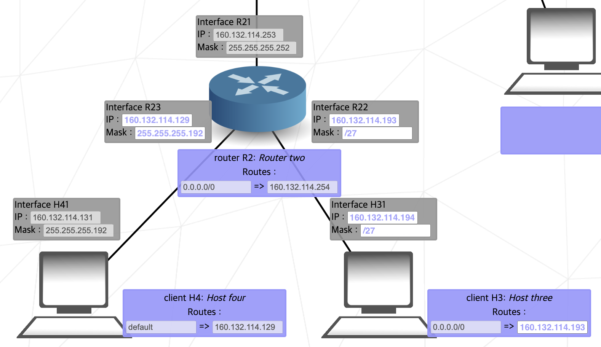 

_Interface R23_ 은 _Interface H41_ 과 연결되어 있으므로 <b>서브넷 마스크(/26)를 일치시킨다.</b>  
_Interface H41_ 의 IP 주소와 서브넷 마스크를 & 연산하면 다음과 같은 주소 범위가 나온다.  

    160.132.114.129 ~ 160.132.114.191

따라서 _Interface R23_ 의 IP 주소를 위의 서브넷 네트워크 범위 내에서 설정한다.  

    router R1 --- switch S1
        : 160.132.114.1/25 ~ 160.132.114.126/25

    router R1 --- router R2
        : 160.132.114.253/30 ~ 160.132.114.254/30

    router R2 --- client H4
        : 160.132.114.129/26 ~ 160.132.114.191/26

    router R2 --- client H3
        : 160.132.114.193/27 ~ 160.132.114.254/27

지금까지 위의 범위를 사용하지 않으면서, 인터넷 라우팅 테이블의 destination 범위 안에 있으려면, _Interface R22_ 와 _Interface R31_ 의 서브넷 마스크는 <b>/27</b> 이 적당하다.  
하지만, _Interface R13_ 과 _Interface R21_ 이 끝 범호 _253, 254_ 는 사용하고 있으므로, <b>_160.132.114.193/27 ~ 160.132.114.252/27_</b> 범위 내에서 IP 주소를 입력한다.  

Answer

    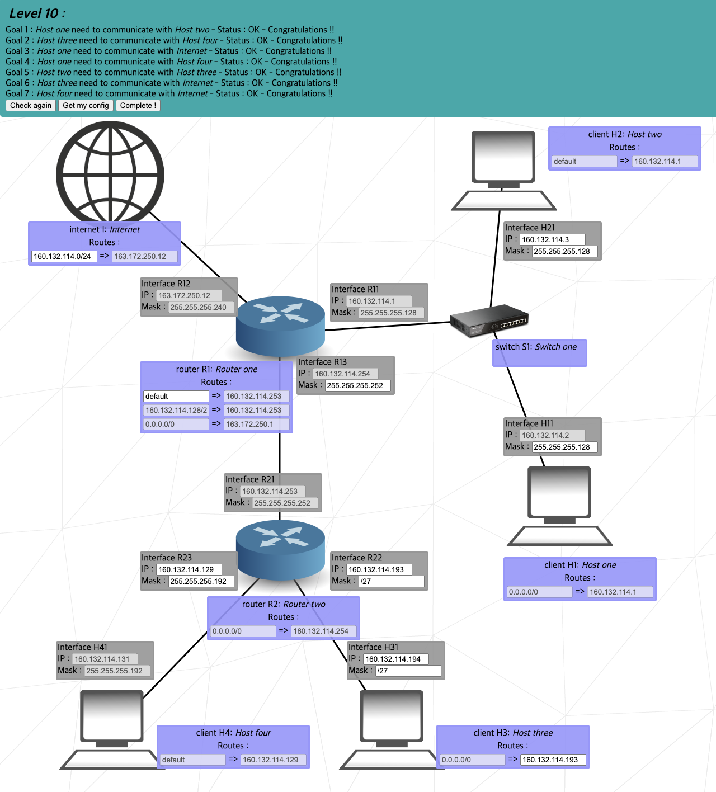

