# NetPractice

## TCP/IP

인터넷에서 표준으로 사용되는 네트워크 프로토콜이다.  
이 프로토콜을 사용하여 전송되는 데이터는 <b>_패킷_</b>이라는 단위로 나뉘어져 통신한다. 각각의 패킷에는 상대방의 IP 주소가 포함되어 있고 네트워크에 흘러서 상대방에게 전달된다.  
IP는 네트워크 각 기기의 주소를 할당하거나 해당 주소를 기반으로 패킷을 전송하는 역할을 한다.  
TCP는 패킷의 수신 확인을 실시하며 올바른 순서로 패킷이 전달되도록 보장한다.  

 

## IP (Internet Protocol)

 

    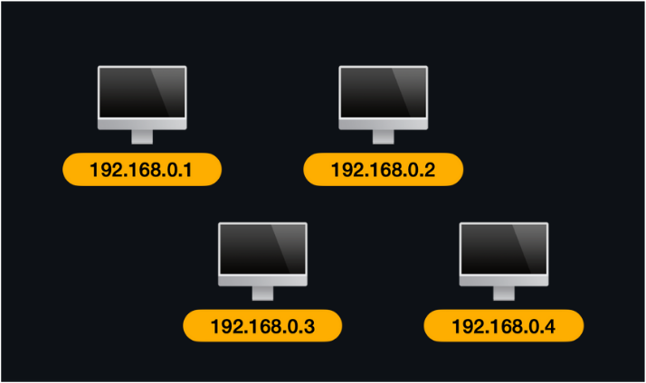

 

네트워크 상의 기기에 주소를 할당하거나 해당 주소로 패킷을 전송하는 역할을 수행한다.  
TCP와 같은 상위 계층에서 수신한 패킷에 IP 헤더라는 정보를 추가하여 네트워크에 전송한다. IP 헤더에는 송∙수신지의 IP 주소 등의 정보가 담겨있으며, 패킷은 이를 바탕으로 올바르게 전송된다.  
IP에는 경로를 선택하는 방법도 정의되어 있어 여러 개의 네트워크를 넘나드는 통신이 가능하다.  
실제로 LAN(Local Area Network)과 외부 네트워크를 연결하는 기기인 <b>_라우터_</b>가 IP 경로 선택(라우팅)을 지원하며, 이 라우터에서 대상이 속해있는 네트워크의 라우터로 패킷이 전송되어 목적지에 도착하는 것이다.

 

## TCP (Transmission Control Protocol)

데이터 손실이 없고, 확실하게 전송되는, 신뢰성이 높은 데이터 통신을 보장한다. 이를 위해 통신 데이터를 패킷으로 분할하고, IP에 전달하여 송신한다.  
네트워크 혼잡 상태에 따라 패킷의 손실이나 지연에 의해 순서가 뒤바뀌지 않도록 몇 가지 방법을 사용한다.

1. 분할 순으로 시퀀스 번호를 부여한다.  
   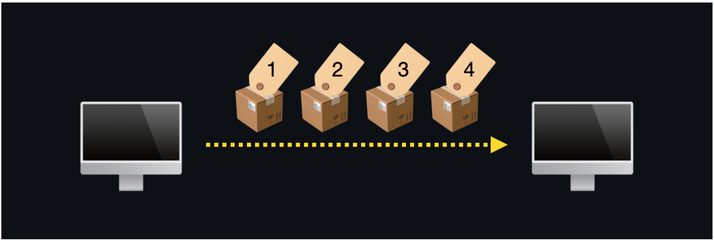

2. 수신 측에서는 수신 패킷(ACK 패킷)을 송신 측에 전송한다.  
   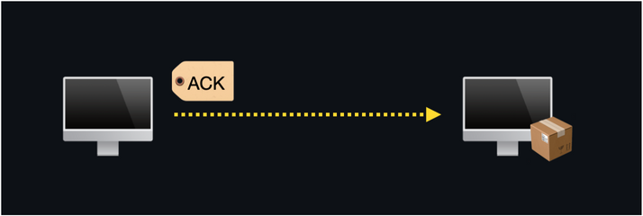

3. 일정 시간이 지나도 응답이 없는 경우 패킷을 재전송하여 손실을 방지한다.  
   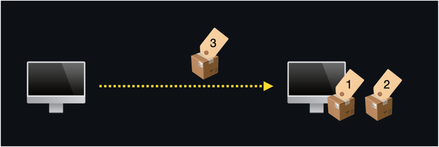

 

## Packet

패킷은 컴퓨터 통신에서 작게 분할된 통신 데이터 단위를 말한다.   

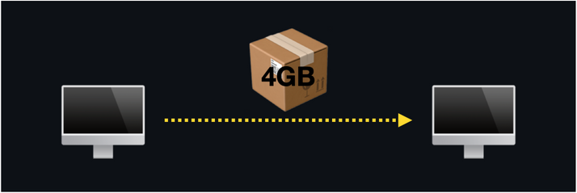
 

큰 데이터가 분할되지 않고 네트워크로 전송되면 이 데이터가 회선을 점유하여 다른 기기가 전혀 통신할 수 없는 문제가 발생한다.   

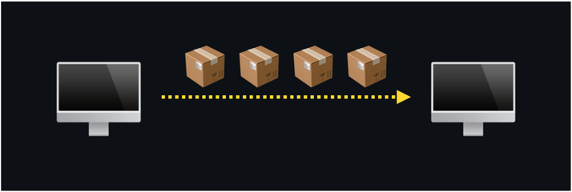
 

따라서 통신 데이터 하나가 점유하는 시간을 최소로 만들어 회선을 공유하기 위해 패킷 단위로 작게 분할한다.  
패킷에는 반드시 송신지와 수신지의 주소 같은 속성 정보가 포함되어 있어 네트워크를 통해 패킷이 올바른 목적지에 운반된다.  
패킷에는 패킷이 사용하는 네트워크 프로토콜에 대한 정보도 포함되어 있어, 여러 네트워크 프로토콜이 동일한 네트워크 회선 상에 혼재된 상태에서도 이용할 수 있다.  
통신 경로에 1초간 전송할 수 있는 데이터양은 네트워크 규격마다 정해져 있다.  

 

## Node

네트워크에 연결되어 있는 네트워크 기기나 네트워크의 연결 지점을 <b>_노드_</b>라고 한다.  
즉, 네트워크 케이블의 연결점이나 분기점이 되는 부분이 노드라는 의미로, 실제로는 네트워크에 연결된 기기라는 의미로 대부분 사용된다.  
네트워크에 연결된 컴퓨터, 허브, 라우터 등도 모두 노드이다.  
일반적으로 네트워크에서 컴퓨터끼리 직접 통신하는 경우는 드물며, 중간 기기가 중개하는 경우가 많다.

 

## IP Address

각 컴퓨터 한 대마다 할당된 식별 번호가 IP 주소다. 32비트의 숫자로 나타내는 IPv4가 일반적이다. (ex. 192.168.0.1)  
실제로 IP 주소의 내용은 네트워크 별로 나뉘는 <b>_'네트워크 주소'_</b> 부분과 그 네트워크 내에서 컴퓨터를 식별하기 위한 <b>_'호스트 주소'_</b> 부분을 조합하여 구성된다.  

 

## IP Address Class

IP 주소 클래스는 IP 주소 체계를 네 가지 주요 클래스로 나누어 관리하는 방법을 설명한다.  

    클래스 A 주소 대역 (1.0.0.0 ~ 126.0.0.0)
    : 첫 번째 옥텟이 네트워크 식별자로 사용되고 남은 3개의 옥텟은 호스트 주소로 사용된다. 클래스 A 주소는 대규모 네트워크에 할당된다.

 

    클래스 B 주소 대역 (128.0.0.0 ~ 191.0.0.0)
    : 첫 번째 2개의 옥텟이 네트워크 식별자로 사용되고 남은 2개의 옥텟은 호스트 주소로 사용된다. 클래스 B 주소는 중간 규모의 네트워크에 할당된다.

 

    클래스 C 주소 대역 (192.0.0.0 ~ 223.0.0.0)
    : 첫 번째 3개의 옥텟이 네트워크 식별자로 사용되고 마지막 옥텟은 호스트 주소로 사용된다. 클래스 C 주소는 소규모 네트워크에 할당된다.

 

    클래스 D 주소 대역 (224.0.0.0 ~ 239.0.0.0)
    : 클래스 D 주소는 멀티캐스트 그룹 통신에 사용된다. 멀티캐스트 주소는 여러 호스트에 패킷을 동시에 전송하는데 사용된다.

 

    클래스 E 주소 대역 (240.0.0.0 ~ 255.0.0.0)
    : 클래스 E 주소는 특정 실험 및 연구를 위해 예약되어 있다.

 

    루프백 주소 (127.0.0.0 ~ 127.255.255.255)
    : 위 IP 주소의 범위는 루프백 주소로 예약되어 있으며, 이 주소 범위의 각 IP 주소는 로컬 호스트 또는 로컬 머신을 가리키며, 데이터를 루프백 인터페이스를 통해 자체로 전달한다.
    index.html을 로컬에서 만든 후 브라우저 창으로 열면, 다음과 같이 열리는 것을 확인할 수 있다. (http://127.0.0.1:5500/index.html)

 

## Subnet Mask

네트워크의 규모가 커지면 단일 네트워크로 관리하는 것이 사실상 어렵다. 특히 <b>_브로드캐스트_</b>라고 하는 네트워크 전체에 송신하는 데이터 전송이 발생할 경우 필요하지 않은 범위까지 불필요하게 회선을 사용하게 되어 네트워크 전체 효율이 나빠진다.   

    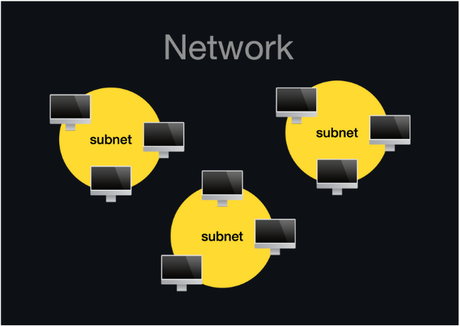

 

이러한 문제를 해결하기 위해 네트워크를 논리적으로 분할하는데, 이것이 <b>_서브넷_</b>이다. 즉, 원래는 하나여야 할 네트워크를 작은 단위로 분할한 것을 말한다.   

    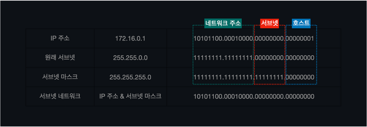

 

<b>_서브넷 마스크_</b>는 이러한 서브넷을 표현하기 위한 값으로, IP 주소의 앞에서부터 몇 비트까지 네트워크 주소로 사용할지 정의하기 위해 사용한다.  
IP 주소는 네트워크 주소 부분과 호스트 주소 부분으로 나뉘는데, 서브넷 마스크에 의해 호스트 주소 부분 중 몇 개의 비트를 네트워크 주소 부분으로 재정의하여, 단일 네트워크를 서브넷으로 구분할 수 있다.  
여기서 호스트 개수는 서브넷 네트워크 주소와 브로드캐스트 주소를 제외한 뒤의 비트 1 ~ 254로 총 254개이다.  

 

## CIDR (Classless Inter-Domain Routing)

IP 주소와 그와 관련된 서브넷 마스크를 표기하기 위한 방법이다. CIDR 표기법은 IP 주소 뒤에 서브넷 마스크의 길이를 / 로 표시하여 사용한다. 이 표기법을 사용하면 IP 주소 클래스에 의존하지 않고 IP 주소 할당을 관리할 수 있다.

    IP 주소 / 서브넷 마스크 길이

 

<b> 예시 1) 192.168.0.1/25가 의미하는 서브넷 마스크 값은? </b>  

25 비트를 네트워크 주소르 사용하고, 나머지 7 비트를 호스트 주소로 사용하겠다는 의미이다.   즉, _255.255.255.128(11111111.11111111.11111111.10000000)_ 이 서브넷 마스크 값이다.  

 

<b> 예시 2) IPv4의 C 클래스 네트워크를 26개의 서브넷으로 나누고 , 각 서브넷에는 4~5개의 호스트를 연결하려고 한다. 이러한 서브넷을 구성하기 위한 서브넷 마스크 값은? </b>  

_255.255.255.128_ 의 경우 2개의 서브넷으로 나눌 수 있다. (네트워크 주소를 1개 쓸 경우, 0 또는 1)  
_255.255.255.192_ 의 경우 4개의 서브넷으로 나눌 수 있다. (네트워크 주소를 2개 쓸 경우, 00 01 10 11)  
...  
_255.255.255.248_ 의 경우 32개의 서브넷으로 나눌 수 있다. (네트워크 주소를 5개 쓸 경우, 00 01 10 11)  
따라서 네트워크를 26개의 서브넷으로 나누기 위해서는 _255.255.255.248_ 서브넷 마스크를 구성하면 된다.

 

## Switch

 

## Router

 

## Routing table

 

 

## Level 1

    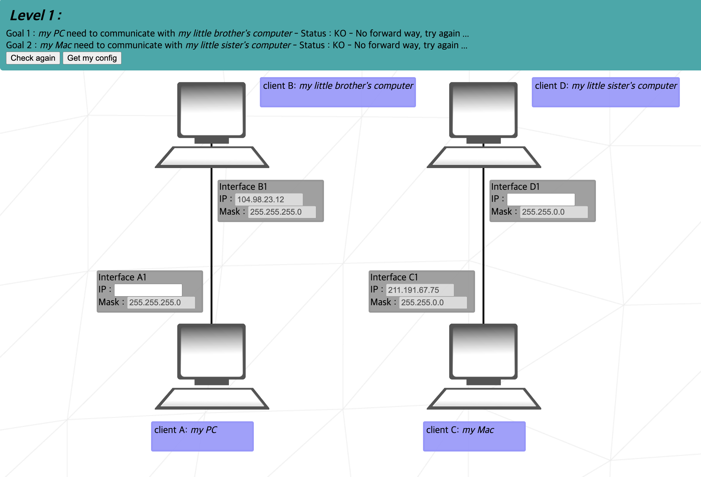

 

Level 1은 _Interface A1_ 과 _Interface B1_, 그리고 _Interface C1_ 과 _Interface D1_ 이 각각 같은 LAN 상에 연결되어 있다.  
_Interface B1_ IP 주소와 해당 서브넷 마스크 _255.255.255.0(11111111.11111111.11111111.00000000)_ 을 & 연산하면,  

    Interface B1 IP | 01101000 01100010 00010111 00001100
    Subnet Mask     | 11111111 11111111 11111111 00000000
    & 연산           | 01101000 01100010 00010111 00000000

따라서 _Interface A1_ 의 IP 주소는, _104.98.23.1 ~ 104.98.23.254_ 사이에서 12를 제외한 값이다. (0은 네트워크 주소이고, 255는 브로드캐스트 주소이며, 12는 _Interface B1_ 의 주소이다.)  

마찬가지로 _Interface C1_ IP 주소와 해당 서브넷 마스크 _255.255.0.0_ 을 & 연산하면,  

    Interface C1 IP | 11010011 10111111 01000011 01001011
    Subnet Mask     | 11111111 11111111 00000000 00000000
    & 연산           | 11010011 10111111 00000000 00000000

따라서 _Interface D1_ 의 IP 주소는, _211.191.0.1 ~ 211.191.255.254_ 사이의 값이다.  

Level 1

    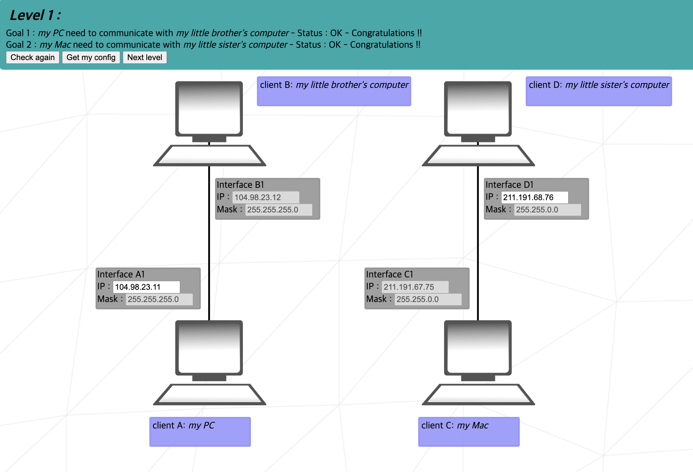

 

 

## Level 2

    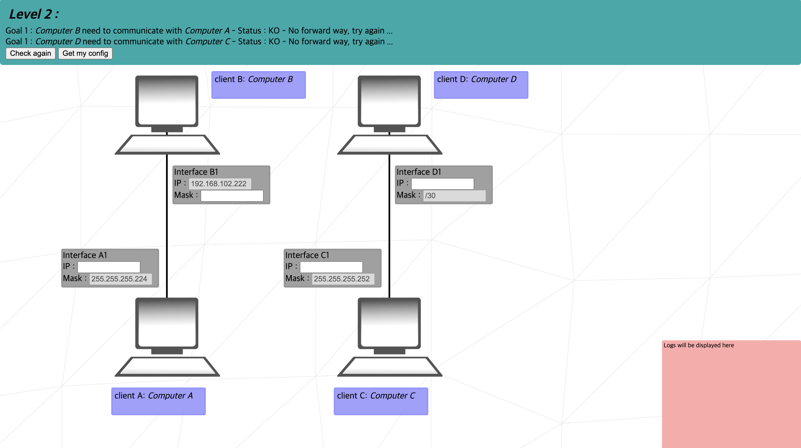

 

Level 2

    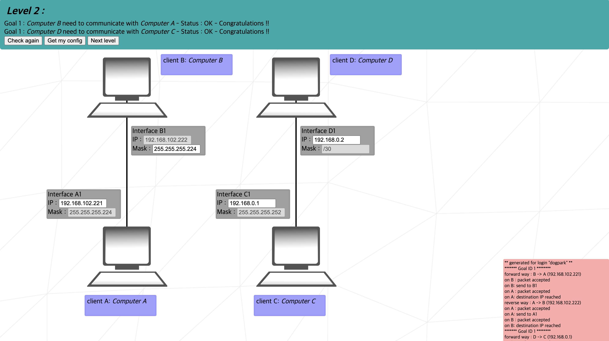

 

 
